<h1 align="center">Hi 👋, I'm Deep Thakkar</h1>
<h3 align="center">Senior Java and FileNet Developer</h3>

  

  

- 🔭 I’m currently working on **enterprise-grade backend solutions in Java and IBM FileNet**
- 🌱 I’m currently learning **AWS, DevOps, and Cloud Architecture**
- 👯 I’m looking to collaborate on **Spring Boot & Microservices Projects**
- 💬 Ask me about **Java, Spring Boot, FileNet, REST APIs**
- 📫 Reach me at my **[LinkedIn](https://linkedin.com/in/imdeepthakkar)**

---

### 🧰 Tech Stack:

---

### 📊 GitHub Metrics:

---

### 🤝 Connect with me:

  
  

